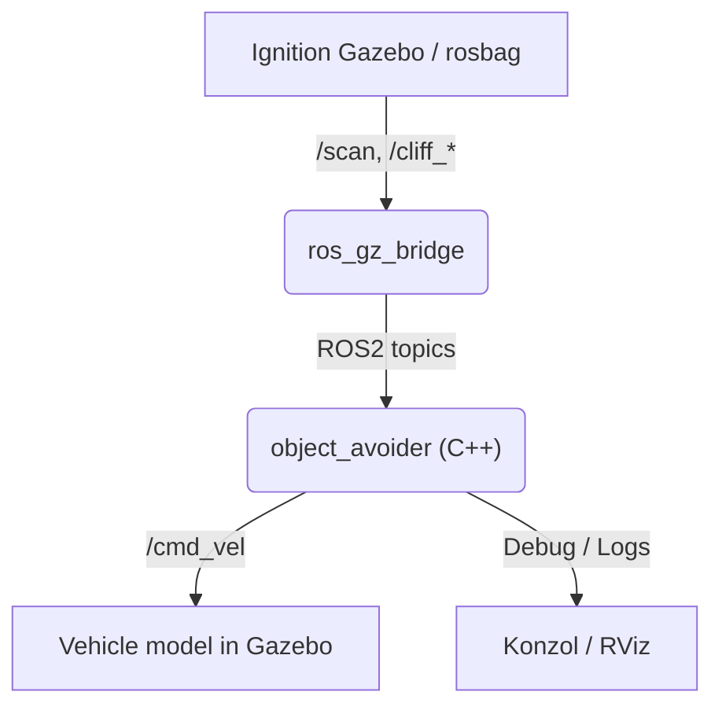

# Lane Tracker

ROS 2 C++ csomag a sávkövetéshez és sávközép kiszámításhoz. [](https://docs.ros.org/en/humble/)

Lane Tracker 🚗💨Ez a ROS 2 csomag egy autonóm jármű szimulációját valósítja meg Ignition Gazebo környezetben. A jármű egy falak nélküli, emelt pályán halad, ahol képes a sávtartásra, dinamikus akadálykerülésre, és a pálya szélének érzékelésére ("Cliff Detection") a leesés elkerülése érdekében.
A projekt C++ nyelven íródott (rclcpp), és demonstrálja a szenzor-fúzió (Lidar + Odometria + Cliff Sensors) és a reaktív irányítás alapjait.

🚀 Funkciók
- Dinamikus Sávváltás: A jármű alapértelmezetten a jobb sávban halad. Ha akadályt észlel (`/scan`), automatikusan átsorol a bal sávba, majd vissza, ha az út tiszta.
- PID Sávtartás: Proporcionális szabályozóval (PID) tartja a járművet a virtuális sávközépen (Y = -2.0 és Y = 2.0).
- Cliff Detection (Szakadék-érzékelés): Két lefelé néző lézeres szenzor (`/cliff_left`, `/cliff_right`) figyeli a talaj meglétét. Ha a jármű kereke elhagyná az aszfaltot, a rendszer azonnal beavatkozik.
- Időzített Vész-Korrekció: Ha a jármű eléri a pálya szélét, egy időzített (1.0 másodperces), határozott ellenkormányzási manőverrel visszatereli a járművet a biztonságos zónába.
- Gazebo Szimuláció: Teljes fizikai szimuláció emelt úttesttel és statikus akadályokkal.

---

## Rövid leírás

Ez a csomag kamera- vagy szimulációs bemenetből dolgozva észleli az út sávját, kiszámolja a sávközépet, és folyamatosan publikálja a követési információkat ROS2-topikokon. Alkalmas önvezető és asszisztált vezetési kutatásokhoz, valamint oktatási célokra.

## 🛠️ Előfeltételek

A futtatáshoz az alábbi környezet szükséges:
- Ubuntu 22.04 LTS (Jammy Jellyfish)
- ROS 2 Humble Hawksbill
- Ignition Gazebo Fortress
- ros_gz_bridge (A ROS 2 és Gazebo kommunikációjához)

## Csomagok és build

> Megjegyzés: A workspace könyvtárad legyen `~/ros2_ws/`.

### 1. Klónozás

```bash
cd ~/ros2_ws/src
git clone https://github.com/pummertibor/lane_tracker.git
```

### 2. Build

```bash
cd ~/ros2_ws
colcon build --packages-select lane_tracker
```

<details>
<summary>ℹ️ <b>Ne felejtsd el forrásolni a workspace-t a ROS parancsok előtt!</b></summary>

```bash
source install/setup.bash
```
</details>

---

## ▶️ Indítás

A szimuláció és a vezérlő logika egyetlen launch fájllal indítható. A csomag launch fájljai a `launch/` könyvtárban található

Példa indítás:

```bash
# Sourcing után indítsd a launch fájlt
source install/setup.bash
ros2 launch lane_tracker lane_tracker_launch.py
```

Paraméterek átadása a launch-nak:

```bash
ros2 launch lane_tracker lane_tracker_launch.py
```

A launch fájl elindítja:
- Ignition Gazebo-t a pályával és a járművel
- ROS GZ Bridge-et a szenzoradatok átviteléhez
- Az `object_avoider` C++ node-ot, amely vezérli a járművet

---
## 🧠 Rendszerfelépítés

A rendszer egy fő C++ node-ra épül (`object_avoider`), amely az alábbi topicokat használja:

Topic-ok (Subscribed)
- /scan — sensor_msgs/LaserScan — Elülső LIDAR, akadályok detektálása.
- /odom — nav_msgs/Odometry — A jármű pozíciója és orientációja (Yaw).
- /cliff_left — sensor_msgs/LaserScan — Bal első, lefelé néző szenzor (pályaszél detektálás).
- /cliff_right — sensor_msgs/LaserScan — Jobb első, lefelé néző szenzor (pályaszél detektálás).

Topic-ok (Published)
- /cmd_vel — geometry_msgs/Twist — Sebesség és kormányzási parancsok a járműnek.

Vezérlési Állapotgép (State Machine)
A kód az alábbi állapotok között vált:
- DRIVING_RIGHT: Normál haladás a jobb sávban.
- SWITCHING_LEFT: Akadály észlelésekor átsorolás balra.
- DRIVING_LEFT: Haladás a bal sávban (előzés).
- SWITCHING_RIGHT: Visszatérés a jobb sávba.
- CLIFF_CORRECTION (Override): Bármely állapotot felülír, ha a cliff szenzorok veszélyt jeleznek.


